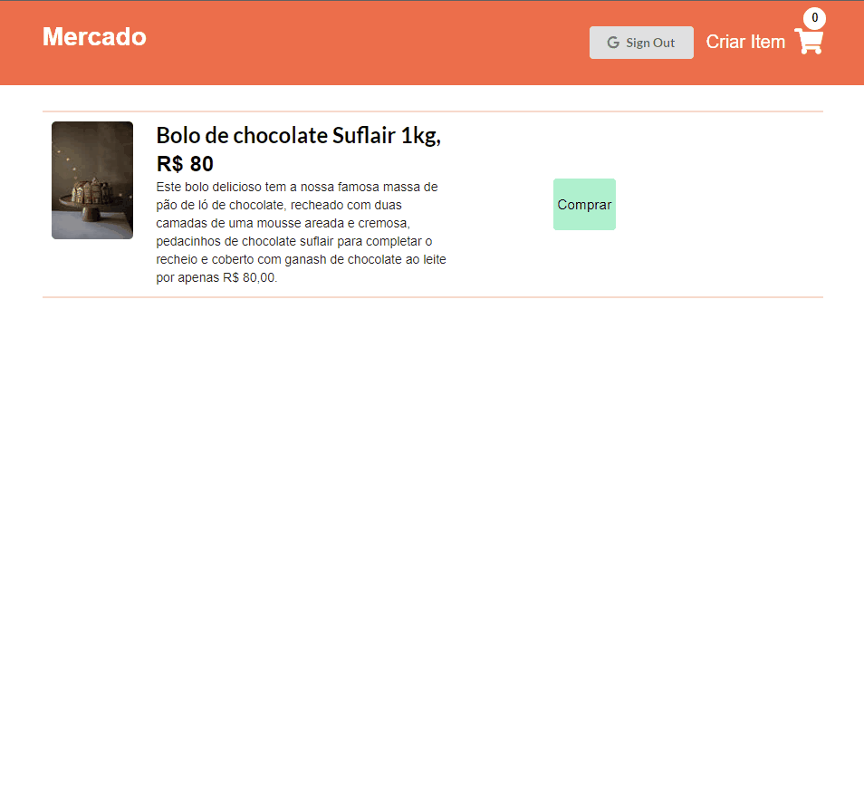
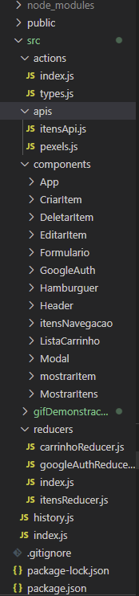

<h1 align="center">Mercado</h1>

<h2>Tabela de Conteúdos</h2>
<ul>
    <li><a href="#visaoGeral">Visão Geral</a></li>
    <li><a href="#sobre">Sobre o Projeto</a></li>
    <li><a href="#construidoCom">Recursos Utilizados Para a Construção do Projeto</a></li>
    <li><a href="#estrutura">Estrutura do Projeto</a></li>
    <li><a href="#comoUtilizar">Link para acessar o site</a></li> 
</ul>

<h2 align="center" id="visaoGeral">Visão geral</h2>

<h2 id="sobre" align="center">Sobre o projeto</h2>

Essa aplicação foi construída como uma forma de colocar em prática tudo o que aprendi no curso <a href="https://www.udemy.com/course/react-redux/">"Modern React with Redux"</a>. A proposta deste projeto é simular um pequeno web commerce com um back-end simples construído através da biblioteca JSON Server. Construir essa aplicação foi uma ótima maneira de consolidar o meu conhecimento com o Redux, React, requisições http básicas (CRUD), roteamento utilizando React Router, validação de formulário utilizando React Final Form e a implementação de um sistema de login utilizando o Google OAuth

 

Apenas quem criou o item pode alterá-lo, essa autenticação é feita de acordo com as informações providas pela biblioteca de autenticação do Google, por tanto os botões de edição e exclusão apenas ficam disponíveis para o criador do mesmo. Sempre que uma alteração é feita no back-end da aplicação, seja pela edição ou exclusão de algum item, o carrinho também é atualizado com as novas informações.

 

Sempre que um item é cadastrado uma requisição http é feita para a API <a href="https://www.pexels.com/pt-br/">Pexels</a>. Ela é responsável por viabilizar imagens de acordo com o item que está sendo cadastrado. Esse site é totalmente responsivo para dispositivos móveis.

<h2 id="construidoCom" align="center">Recursos utilizados nessa aplicação</h2>
<ul>
    <li>React</li>
    <li>React Portals</li>
    <li>React Router</li>
    <li>React Final Form</li>
    <li>Hooks</li>
    <li>Google OAuth</li> 
    <li>Json Server</li>
    <li>Redux</li>
    <li>Redux-Thunk</li>
    <li>Axios</li>
    <li>Css</li>
    <li>Media Queries</li>
</ul>

<h2 align="center" id="estrutura">Estrutura do Projeto</h2>

<h2 id="comoUtilizar" align="center">Como utilizar</h2>

Você pode acessar essa aplicação através desse <a href="https://mercadosimulator.netlify.app">link.</a> Sinta-se à vontade para adicionar algum item no site! 

